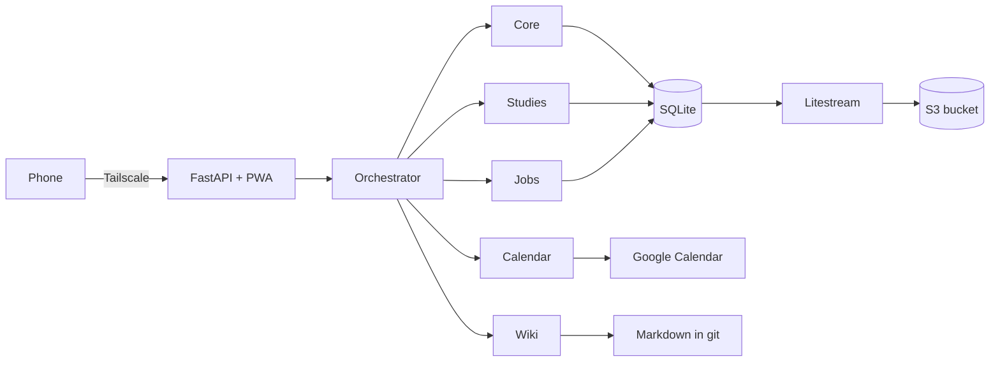

# Secretary

My personal assistant. It keeps my tasks, courses, job applications and calendar in one place. I talk to it from my phone, by text or voice, and it runs on a small server at home.

I built it to replace the Notion workspace I was using to organize my life. Notion was fine for storing things, but I still had to do all the organizing myself. With Secretary I can just say "move my study block to Friday evening" or "what's left for the algebra exam?" and it takes care of it.

> **Before you use it:** this project was vibecoded. I built it with an AI coding assistant, reviewing and testing as I went, but it has not had the kind of careful review that software handling your data should get. **It is not production ready.** Run it for yourself, on your own machine, and keep backups.

## The idea: an LLM Wiki

The memory side is based on Andrej Karpathy's [LLM Wiki](https://gist.github.com/karpathy/442a6bf555914893e9891c11519de94f) pattern. Instead of making the model rediscover everything on every question (the usual RAG approach), you give it a set of Markdown pages that it maintains itself. Knowledge builds up over time instead of being rebuilt from scratch.

My version works like this:

- A folder of Markdown pages (`profile.md`, `rules.md`, `decisions.md`, notes per course, a weekly journal) lives in its own git repository.
- The agent reads the index, my profile and my rules on every request, so it knows what I care about and how I like my time organized.
- It writes and updates pages itself, and every change is a git commit. If it writes something wrong, `git revert` fixes it.
- It can't touch `rules.md` or `profile.md` without asking me first. That way a text it reads somewhere can't quietly rewrite my rules.

On top of that, anything with dates and statuses (tasks, exams, applications) lives in SQLite, because a database is simply better at answering "what's due this week?" than a pile of Markdown files.

## What it does today

- **Chat and voice** from a web app you can install on your phone. Voice is transcribed on the server with faster-whisper, and the audio is deleted right away.
- **Tasks** with priorities, areas, due dates and time estimates.
- **Studies**: courses, exam dates, study units with hours and confidence, and coursework linked to each course.
- **Job search**: applications, stages, deadlines and follow-ups.
- **Google Calendar**: read, create and move events. Moving events, or creating several at once, waits for my confirmation.
- **Wiki memory** as described above.
- **Notion import**, safe to run several times, so I could use both side by side while moving over.
- **A data view** of every table, and a CSV export of the token log so I can see what each request costs.
- **Archived items are deleted after 30 days** unless I reopen them first. The agent itself can never delete anything.

Still to come: a weekly planner that uses a constraint solver (OR-Tools) to fit study blocks around my rules, scheduled summaries and reminders, and a proper evaluation suite.

## How it works



- **One orchestrator, one small agent per module.** The orchestrator only sees one tool per module ("delegate to studies"). The module's own agent has the detailed tools. This keeps each prompt small, and adding a module doesn't make the others more expensive.
- **The model interprets, code decides.** Dates, queries and confirmations are handled in code. The agent gets a two-week calendar computed for it instead of counting days itself.
- **The database enforces the rules.** Each module can only write its own tables (an SQLite authorizer checks every statement), and triggers refuse any delete except for rows archived long enough.
- **Confirmations never go through the model.** A risky change is stored as a proposal, and when I tap "Confirm" the app runs exactly that stored call.
- **Swappable model provider.** It runs on a Claude subscription, the Anthropic API, or a fake provider for tests and offline use.
- **Private by default.** It's only reachable through my Tailscale network, the database is replicated to a bucket with Litestream, and none of my data lives in this repository.

More detail in [docs/ARCHITECTURE.md](docs/ARCHITECTURE.md). Deployment, backups and setup for each integration are in [docs/OPERATIONS.md](docs/OPERATIONS.md).

## These modules fit me. Make it fit you.

The modules and tables here are the ones that work for my life right now: studying, looking for a job and keeping a calendar under control. They're probably not the right set for you, and that's fine. The project is built so you can change them:

- Every module is a folder in `modules/` with a `module.yaml` (description and model), a `prompt.md`, a `tools.py` and its own SQL migrations. Add a folder and the orchestrator picks it up. You don't need to touch the core.
- Turn off what you don't need, or change a module's model, in `config.yaml`:
  ```yaml
  modules:
    jobs:
      enabled: false
    studies:
      model: sonnet
  ```
- The wiki template in `modules/wiki/template/` is a starting point. Write your own rules and profile, since that's what makes the agent useful.

I'd much rather you take the parts you like and shape them around how you work than copy my setup as it is.

## Try it

You need Docker. By default there's no model behind it (it just replies that none is configured), so you can look around without any account or key.

```sh
git clone https://github.com/MarcosExp/secretary-llm.git
cd secretary-llm
cp .env.example .env
docker compose up -d --build
docker compose exec app secretary db seed-example   # fictional example data
```

Open http://localhost:8000. To talk to a real model, set `LLM_PROVIDER` in `.env` to `subscription` (with a token from `claude setup-token`) or `api` (with an Anthropic API key), then restart. The command line works too:

```sh
docker compose exec app secretary task list
docker compose exec app secretary ask "what do I have due this week?"
```

For Google Calendar, Notion, backups and phone access, follow [docs/OPERATIONS.md](docs/OPERATIONS.md).

## Development

```sh
pip install -e ".[dev]"
pytest
```

The tests use a scripted fake model, so they don't need any keys or network access.

## Keeping personal data out of git

My real data lives in a separate folder outside the repo (`SECRETARY_DATA_DIR`). A pre-commit hook runs gitleaks and blocks any commit that contains a word from a private list (`.personal-terms`, never committed). If you fork this, enable it with:

```sh
git config core.hooksPath .githooks
cp .personal-terms.example .personal-terms   # then add your own terms
```

## License

[MIT](LICENSE). Use it, change it, make it yours.
