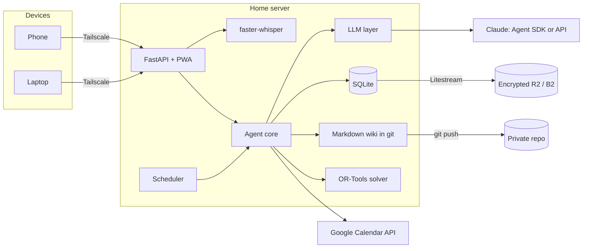
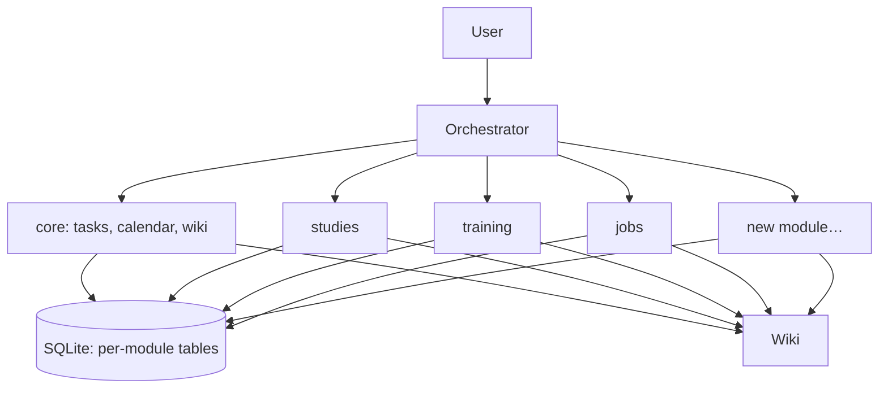

# Secretary: architecture

A personal organization agent (tasks, studies, calendar, training, job search) that replaces a Notion-style workspace. It is used daily by text and voice from any device and runs on a home server.

**What it demonstrates:** tool-using agent design, LLM + optimizer, persistent memory, self-hosting with backups, and measurable evaluation.

## 1. Design principles

1. **The LLM interprets and writes; code decides.** Queries, dates and schedules are resolved by SQL and the solver, not by the model.
2. **Structured data in a database, context in Markdown.** Tasks and dates live in SQLite; decisions, rules and notes live in a wiki.
3. **Never delete.** Everything is archived (`status = archived`). The agent has no delete tool.
4. **Confirmation for large changes.** The agent proposes a plan and only executes it after confirmation.
5. **Swappable LLM provider.** Subscription, API or a fake provider for tests, selected with one environment variable.
6. **Small MVP.** Tasks, calendar, memory and weekly review. Nothing else until that works.
7. **Everything is a module.** Adding a capability means adding a folder; neither the core nor the orchestrator changes.
8. **Public code, private data.** The repository contains no user data (see §9).

## 2. Architecture



| Component | Technology | Role |
|---|---|---|
| Interface | FastAPI + PWA | Text chat and a record button; installable on the phone. |
| Voice | faster-whisper (`small`, CPU) | Local transcription. Audio is deleted after transcribing. |
| Agent core | Python | Agent loop, tool registry, confirmations and logging. |
| LLM layer | `LLMProvider` interface | `FakeProvider`, `ApiProvider` (API key) and `SubscriptionProvider` (Claude Agent SDK). |
| Data | SQLite + Litestream | Continuous replication to an encrypted bucket. |
| Memory | Markdown wiki (*LLM Wiki* pattern) | Rules, decisions, profile and notes, versioned with git. |
| Planner | OR-Tools (CP-SAT) | Places the week's blocks while respecting constraints. |
| Scheduler | APScheduler | Daily summary, weekly review, reminders and calendar sync. |
| Network | Tailscale | Private access without opening ports. |
| Deployment | Docker Compose | One container per service, isolated from the rest of the server. |

## 3. Data model

The migrations are the source of truth: [`modules/core/migrations`](../modules/core/migrations) and [`modules/studies/migrations`](../modules/studies/migrations). Summary:

| Table | Owner | Content |
|---|---|---|
| `core_areas` | core | Life areas (Work, Studies, …) |
| `core_tasks` | core | Title, status (`todo`, `doing`, `done`, `archived`), priority (`P1` today, `P2` this week, `P3` someday), area, due date, estimate, notes, timestamps |
| `core_schedule_blocks` | core | Fixed weekly blocks used by the planner, with their Google Calendar event ID |
| `core_agent_log` | core | Every agent call: input, tools called, output, model and tokens |
| `studies_programs`, `studies_courses`, `studies_units` | studies | Programs, courses with exam dates, study units with estimated and done hours and confidence (1-5) |
| `studies_course_tasks` | studies | Links courses to core tasks. The dependent module owns cross-module references. |
| `schema_migrations` | runner | Applied migrations with checksums |

Rules enforced by the database itself:

- **Every table is prefixed with its module**, so ownership is visible in the name and access control (§6) is a prefix check.
- **Nothing is ever deleted.** A `BEFORE DELETE` trigger on every table aborts the statement; rows are archived instead.
- **`CHECK` constraints** on statuses, priorities, ISO dates, `HH:MM` times, positive estimates and confidence 1-5. The Python layer validates first for clear error messages, and the constraints are the backstop.

**Migrations:** each module owns `migrations/NNN_description.sql`, applied in order with core first. Every file runs in one transaction and is recorded with a checksum, so editing an applied migration is an error and schema changes always go in a new file. They run on app startup and on every CLI command.

**Example data:** each module can ship a `seed_example.sql` with fictional rows (dates relative to today). `secretary db seed-example` loads them, only into an empty database.

Later modules: `training_workouts (date, kind, details)` and `jobs_applications (company, role, url, status, applied_at, next_step, notes)`.

## 4. Memory: the wiki

The agent maintains and updates these files instead of rebuilding context on every query. The real wiki lives outside the repo; `examples/wiki/` contains one for a fictional user.

```
wiki/
├── index.md          # wiki map; the agent always reads it
├── profile.md        # goals and priorities
├── rules.md          # organization rules
├── decisions.md      # dated decision log
├── courses/
├── projects/
└── journal/          # one summary per weekly review (YYYY-Www.md)
```

Example rules (fictional):
- On a bad day, only the minimum daily task gets done.
- Leisure and rest are protected.
- Nothing is planned during trips and holidays.
- If the request does not fit the available hours, say so with numbers and propose what to drop.

**Retrieval:** `index.md` + full-text search (ripgrep). Embeddings (sqlite-vec) only once the wiki exceeds roughly 50-100 pages.

## 5. Agent tools

| Tool | Type | Confirmation |
|---|---|---|
| `list_tasks(filters)` | Read | No |
| `add_task`, `update_task`, `complete_task`, `archive_task` | Small write | No |
| `list_courses`, `study_progress`, `log_study_hours` | Read / small write | No |
| `calendar_read(range)` | Read | No |
| `calendar_create_event`, `calendar_move_event` | Write | Yes, when several events |
| `plan_week(constraints)` | Solver, returns a proposal | Yes, before writing to the calendar |
| `wiki_read(path)`, `wiki_search(query)` | Read | No |
| `wiki_write(path, content)` | Write with git commit | No (reversible) |

All tools validate input with Pydantic. There is no delete tool.

## 6. Module system

An **orchestrator** talks to the user and delegates to **modules**: specialized subagents with their own tools, tables and prompt. The core is a module too.



```
modules/jobs/
├── module.yaml        # manifest
├── prompt.md          # generic subagent instructions
├── tools.py           # tools declared with @tool
├── migrations/001_init.sql
├── jobs.py            # (optional) scheduled jobs
└── evals/             # (optional) synthetic test cases
```

```yaml
# module.yaml
name: jobs
description: >
  Finds job offers, scores them against the user's profile and
  tracks applications.
version: 1
model: haiku
reads: [core_tasks, core_schedule_blocks]
schedule:
  - cron: "0 9 * * 6"
    job: weekly_sweep
```

```python
from secretary.sdk import tool, ModuleContext

@tool(description="Add a job offer to the tracker")
def add_offer(ctx: ModuleContext, company: str, role: str, url: str) -> dict:
    return ctx.db.insert("jobs_offers", company=company, role=role, url=url)
```

**Loading:** at startup the core scans `modules/*/module.yaml`, applies pending migrations and registers tools. The orchestrator sees a single `delegate_to_<module>(task)` tool per module, so its context does not grow with each new module. Each module is toggled with `enabled: true/false` in the config.

**Database access:** each module owns its tables (`<module>_*`). It can only read other modules' tables declared in `reads`, never writes them (it calls the owning module's tool instead), and only changes the schema through versioned migrations. `ModuleContext.db` rejects any query outside these rules. A subagent may *propose* a migration (`propose_migration(sql)`), which stays pending until the user approves it.

**MCP:** modules are designed so they can later be exposed as MCP servers.

## 7. LLM layer and costs

```python
class LLMProvider(Protocol):
    def run(self, system: str, messages: list, tools: list) -> AgentResult: ...

PROVIDER = os.getenv("LLM_PROVIDER", "fake")   # fake | api | subscription
```

- Tokens per call are logged in `core_agent_log` from day one.
- Fixed reminders and summaries come from templates and SQL, with no LLM call.
- With the API: Haiku for routine commands, Sonnet/Opus for planning, prompt caching for `index.md` + `rules.md`, and a monthly spend limit.

## 8. Weekly planner

1. Reads fixed blocks, deadlines in the next 10 days, pending study hours and rules.
2. The LLM turns what the user says ("I have an appointment on Thursday, I'm tired") into constraints: `block(thursday, 17:00-20:00)`, `max_load = 80%`.
3. CP-SAT places the blocks. Hard constraints: unavailable hours, fixed activities, minimum leisure, minimum daily task. Soft: spread study time and prioritize earlier deadlines.
4. If there is no solution, it reports which constraint fails and how many hours are missing.
5. After confirmation, it writes to Google Calendar and stores the IDs in `core_schedule_blocks`.

## 9. Security and privacy

- **The repository contains no personal data.** Database, wiki, config, exports, credentials and audio live in `SECRETARY_DATA_DIR`, outside the repo. The repo only holds code, schemas and fictional examples.
- Pre-commit hook with `gitleaks` and a local, unversioned list of personal terms; `gitleaks` also runs in CI.
- Containers run as unprivileged users; the agent does not mount other services' volumes.
- Secrets in `.env` or Docker secrets, never in the repo.
- Access only through Tailscale; the interface is not exposed to the internet.
- External content (emails, web pages, third-party calendar events) is treated as data, never as instructions.
- Encrypted backups and a monthly restore test.

## 10. Repository layout

```
├── docker-compose.yml   # app + litestream, app on host loopback
├── compose.tailscale.yml # optional Tailscale sidecar
├── .env.example
├── deploy/              # litestream.yml, Tailscale Serve config
├── scripts/             # restore test
├── app/
│   ├── ops/          # backup restore check
│   ├── api/          # FastAPI + PWA
│   ├── agent/        # orchestrator, confirmations
│   ├── llm/          # LLMProvider and implementations
│   ├── sdk/          # @tool, ModuleContext, module loader
│   ├── planner/      # CP-SAT model
│   ├── db/           # connection, migrations, access control
│   ├── voice/        # faster-whisper
│   └── scheduler/
├── modules/
│   ├── core/
│   └── studies/
├── examples/         # fictional wiki, config and seed
├── migrate/          # Notion export (IDs from environment)
├── evals/            # synthetic cases and metrics
├── tests/
└── docs/             # ARCHITECTURE.md, OPERATIONS.md
```

## 11. Phases

| Phase | Scope | Done when… |
|---|---|---|
| 0. Infra | Repo hygiene, Docker Compose, Tailscale, SQLite + Litestream, restore test | The database is restored on another machine |
| 1. Data | Config, migrations, schema, fictional seed, minimal CLI | Tasks can be added and listed from the terminal |
| 2. Agent and modules | LLM layer, module loader, access control, `core` and `studies`, token log | "Add submit assignment 2 on Friday" works; a new module is added by creating its folder |
| 3. Calendar | Google Calendar with confirmation | Moves a block after confirmation |
| 4. Interface | PWA with text and voice | Daily use from the phone by voice |
| 5. Migration | Notion → SQLite and wiki, one month in parallel | A full week without opening Notion |
| 6. Planner | CP-SAT and weekly review | Produces a valid week and reports what does not fit |
| 7. Evals and README | Cases, metrics, diagram, demo | README ready |

## 12. Evaluation

- **Tools:** ~50 natural-language commands with the expected call. Metric: % correct tool and arguments.
- **Planner:** 20 synthetic weeks. Metrics: hard constraints met (100%), leisure preserved, hours placed vs. requested.
- **Memory:** questions about past decisions in the example wiki. Metric: correct answer with source.
- **Cost:** average tokens per command and per week, from `core_agent_log`.

Evals run in CI with a fake provider (deterministic) and with the real one on a sample. All cases are synthetic.
